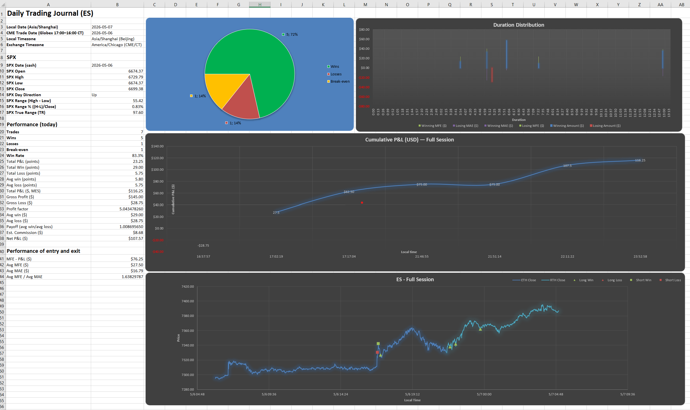
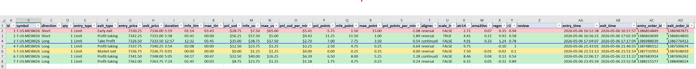

# TV Excel Journal

Generate an Excel trading journal from TradingView-exported order history.

TV means TradingView: this project turns TradingView-exported order executions into a structured Excel trading journal. It is built for traders who want more detail than a broker or platform journal usually provides, while still keeping the final review format in Excel.

---

## Why This Exists

Many professional trading platforms and order-flow tools include built-in journal features. They are useful for quick daily summaries, but they usually stop at surface-level metrics:

- total daily P&L
- total number of trades
- basic win/loss summary

That is helpful, but it is not enough for serious review.

The missing layer is background analysis for each individual trade. A trade is not just an entry, an exit, and a final P&L number. The important part is the path between them, and the market context around them.

This project uses exported order history plus historical market data to help answer questions like:

- What market cycle was this trade taken in?
- After entry, did the trade immediately go into profit or loss?
- What was the profit path during the trade?
- Did the trade make a good profit and then give too much back?
- Did the trade stay negative while I kept hoping instead of stopping out?
- Was this trade closer to a swing trade or a scalp?
- What was the market background around the entry and exit?
- How did this specific trade shape the daily equity curve?

The goal is simple: make daily review more specific, repeatable, and memorable.

---

## Main Workflow

```text
TradingView order-history export
        ↓
Load filled executions
        ↓
Convert execution times into your local review timezone
        ↓
Match fills into trades
        ↓
Calculate trade and daily metrics
        ↓
Optionally fetch IBKR market context
        ↓
Write everything into an editable Excel template
        ↓
Review the final daily report
```

---

## What It Generates

The Excel report is organized around two main review areas:

- **Summary**: stores daily statistics, session metrics, duration distribution, cumulative P&L curve data, and chart data for the selected trading session.
- **Trades**: lists each reconstructed trade with its performance, entry/exit details, direction, quantity, duration, P&L, and optional market context.

Partial exits from the same entry are visually grouped so you can review one trade idea without mistaking every exit fill as a separate setup.

Example generated reports:

- [ES example workbook](examples/workbooks/daily_report_es_2026-05-07.xlsx)
- [NQ/GC example workbook](examples/workbooks/daily_report_nq_gc_2026-05-05.xlsx)
- NQ/GC previews: [Summary](examples/images/nq-gc-summary.png), [Trades](examples/images/nq-gc-trades.png)

**Summary sheet example**



**Trades sheet example**



---

## Editable Excel Templates

The workbook template is meant to be edited.

You can customize the Excel file to match your own journal style, including layout, formatting, formulas, charts, colors, and review notes. The Python code fills the expected sheets and ranges, while the template controls how the final report looks.

If you change sheet names, helper columns, or fixed cell locations, update the matching settings in the code as well.

---

## Local Time Review

The project is currently configured for a trader based in China, so local review time uses `Asia/Shanghai`.

This is intentional: reviewing trades in your own local timeline is easier to remember than reviewing everything in exchange time. If you are in another region, change the local timezone setting in `journal_core/config.py`:

```python
TZ_LOCAL = ZoneInfo("Asia/Shanghai")
```

For example, change it to your own timezone such as:

```python
TZ_LOCAL = ZoneInfo("America/New_York")
```

CME session logic still uses `America/Chicago` internally.

---

## IBKR Market Data Connector

Interactive Brokers is the only market-data connector currently supported by this project.

IBKR is used to fetch historical market context for the report, including:

- MFE and MAE
- ATR14
- EMA20 slope
- regression slope
- R-squared
- continuation/reversal alignment
- full-session 1-minute close data for charts
- market range and true range statistics

To use this feature, start TWS or IB Gateway, enable API access, and set the correct port/client ID in your report configuration.

If you only want to generate the trade journal from exported order history, set:

```python
enable_historical_context=False
```

---

## Basic Usage

Install the current dependencies:

```bash
pip install pandas openpyxl numpy pytz ib-insync
```

Generate a report:

```python
from journal_core import generate_daily_report

generate_daily_report(
    csv_path=r"../raw_order_history/order-history.csv",
    local_date="2026-05-09",
    out_path=r"../daily_report/daily_report_2026-05-09.xlsx",
    instrument_symbols=["ESM26"],
    enable_historical_context=False,
)
```

Or edit `daily_report.py` and run:

```bash
python daily_report.py
```

---

## Supported Instruments

Current futures roots:

| Root | Market |
| --- | --- |
| ES / MES | S&P 500 futures |
| NQ / MNQ | Nasdaq futures |
| GC / MGC | Gold futures |

Template selection is automatic based on `instrument_symbols`.

---

## Disclaimer

This project is for journaling and trade review only. Always verify generated reports against your broker or platform records.

---

# 中文说明

从 TradingView 导出的订单历史生成 Excel 日内交易复盘表。

这个项目会把导出的成交记录整理成一份结构化的每日复盘工作簿。它适合希望保留 Excel 复盘习惯，同时又想看到比平台内置交易日志更细节内容的交易者。

---

## 为什么做这个项目

很多专业交易软件和订单流工具都有内置交易日志。它们适合快速查看每日结果，但通常只停留在比较表层的数据：

- 当天总盈亏
- 当天总交易次数
- 基础胜负统计

这些信息有用，但还不够支撑真正细致的复盘。

真正缺失的是单笔交易的背景分析。一笔交易不只是进场、出场和最终盈亏。更重要的是这笔交易中间经历了什么，以及它发生在什么市场背景里。

这个项目把导出的订单历史和历史行情数据结合起来，帮助你回答这些问题：

- 这笔交易发生在什么市场周期里？
- 进场之后，价格是立刻浮盈还是立刻浮亏？
- 这笔交易的盈利路径是什么样的？
- 是否曾经赚到很多，最后又回吐了大部分利润？
- 是否一直处在亏损中，但因为抱有希望而没有及时止损？
- 这笔交易更像是波段交易，还是剥头皮交易？
- 进场和出场时的市场背景是什么？
- 这笔交易如何影响当天的资金曲线？

目标很简单：让每日复盘更具体、更可重复，也更容易记住。

---

## 主要流程

```text
TradingView 订单历史导出文件
        ↓
读取已成交订单
        ↓
把成交时间转换到你的本地复盘时区
        ↓
把成交记录匹配成完整交易
        ↓
计算单笔交易和每日统计数据
        ↓
可选：通过 IBKR 获取市场背景数据
        ↓
写入可自行编辑的 Excel 模板
        ↓
打开最终日报进行复盘
```

---

## 生成内容

Excel 报告主要围绕两个复盘区域：

- **Summary**：存放每日统计、交易时段指标、持仓时间分布、累计盈亏曲线数据，以及该交易时段的图表数据。
- **Trades**：列出每一笔重建后的交易，包括交易表现、进出场细节、多空方向、数量、持仓时间、盈亏，以及可选的市场背景数据。

同一笔进场产生的分批出场会被视觉分组，方便你把它作为同一个交易想法来复盘，而不是误以为每一次出场都是独立交易。

示例生成文件：

- [ES 示例工作簿](examples/workbooks/daily_report_es_2026-05-07.xlsx)
- [NQ/GC 示例工作簿](examples/workbooks/daily_report_nq_gc_2026-05-05.xlsx)
- NQ/GC 预览图：[Summary](examples/images/nq-gc-summary.png)，[Trades](examples/images/nq-gc-trades.png)

**Summary 工作表示例**


**Trades 工作表示例**


---

## 可编辑 Excel 模板

Excel 模板本身就是给你修改的。

你可以按照自己的复盘习惯调整布局、格式、公式、图表、颜色和备注区域。Python 代码负责把数据写入指定的工作表和区域，模板负责控制最终报告的展示效果。

如果你修改了工作表名称、辅助列或固定单元格位置，也需要同步更新代码里的对应设置。

---

## 本地时间复盘

当前项目按中国交易者配置，本地复盘时区是 `Asia/Shanghai`。

这是有意设计的：用自己的本地时间复盘，比完全使用交易所时间更容易回忆当天的交易状态。如果你在其他地区，可以在 `journal_core/config.py` 里修改本地时区：

```python
TZ_LOCAL = ZoneInfo("Asia/Shanghai")
```

例如改成：

```python
TZ_LOCAL = ZoneInfo("America/New_York")
```

CME 交易时段逻辑内部仍然使用 `America/Chicago`。

---

## IBKR 行情数据连接器

Interactive Brokers 是当前项目唯一支持的行情数据连接器。

IBKR 用来获取历史市场背景数据，包括：

- MFE 和 MAE
- ATR14
- EMA20 斜率
- 回归斜率
- R-squared
- 顺势/逆势判断
- 用于图表的全时段 1 分钟收盘价数据
- 市场波动区间和真实波幅统计

使用这个功能前，需要启动 TWS 或 IB Gateway，开启 API 访问，并在报告配置中设置正确的端口和 client ID。

如果你只想根据导出的订单历史生成交易日志，可以设置：

```python
enable_historical_context=False
```

---

## 基本用法

安装依赖：

```bash
pip install pandas openpyxl numpy pytz ib-insync
```

生成报告：

```python
from journal_core import generate_daily_report

generate_daily_report(
    csv_path=r"../raw_order_history/order-history.csv",
    local_date="2026-05-09",
    out_path=r"../daily_report/daily_report_2026-05-09.xlsx",
    instrument_symbols=["ESM26"],
    enable_historical_context=False,
)
```

也可以修改 `daily_report.py` 后运行：

```bash
python daily_report.py
```

---

## 支持的品种

当前支持的期货根代码：

| 根代码 | 市场 |
| --- | --- |
| ES / MES | 标普 500 期货 |
| NQ / MNQ | 纳斯达克期货 |
| GC / MGC | 黄金期货 |

模板会根据 `instrument_symbols` 自动选择。

---

## 免责声明

本项目仅用于交易日志和复盘，不构成任何交易建议。生成的报告请始终与交易平台或券商记录进行核对。
